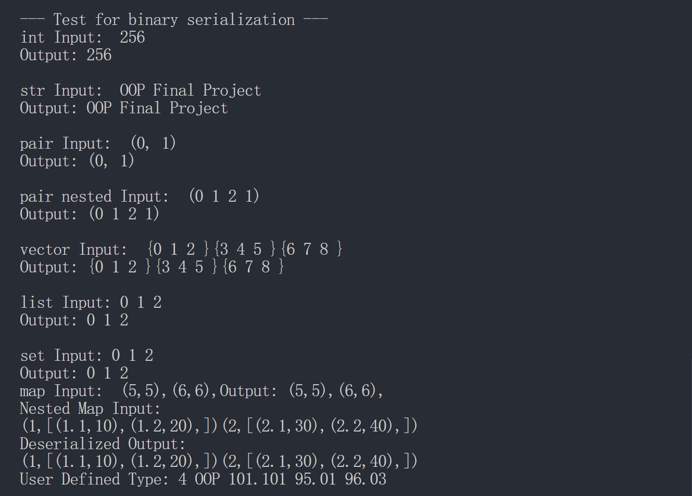
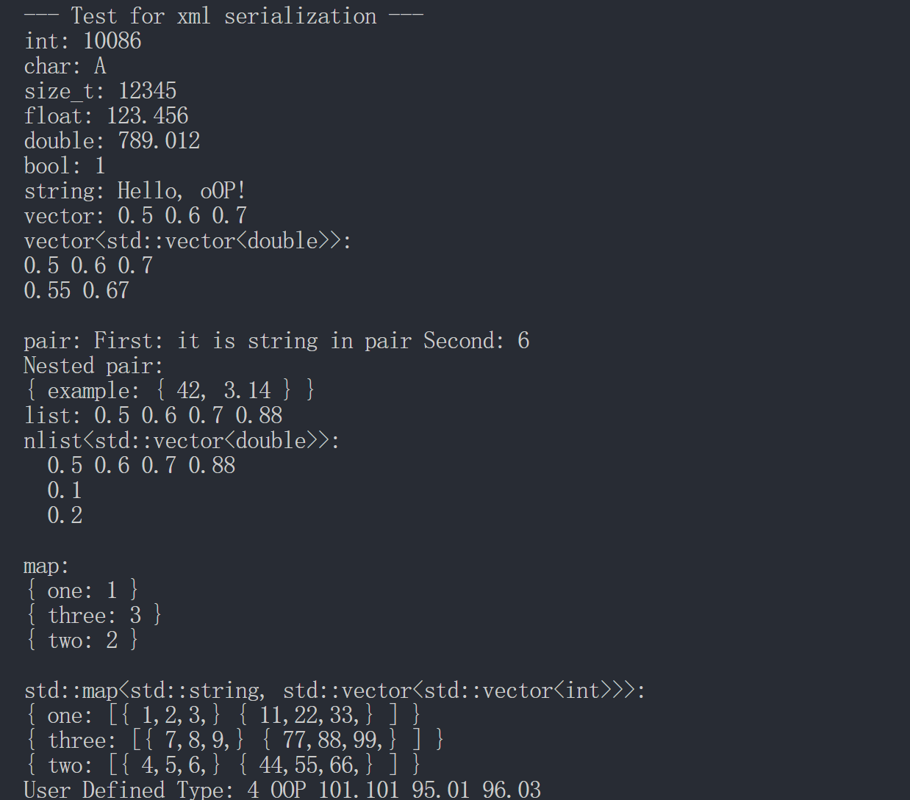

# Object Serialization

## File Structure

- `data`      : Contains the data when run the main test.
- `include`   : Contains the definition of binary and xml serialization.
    - `binary_serialization.h`  binary wrapper
    - `xml_helpfunc.h`          helper function for xml_serialization
    - `xml_serialization.h`     xml wrapper
- `src`       : Contains the test for the project.
    - `main.cpp`    entry for test
- `tinyxml`   : Contains the third party lib tinyxml2.
- `CMakeLists.txt` : To run the test for the project. And the main entry is in the file src/main.cpp
- `images`    : Contains the resource pic in the md

## Environment

- windows 11
- gcc version 8.1.0 
- cmake minimum version 3.10.0
- C++ minimum version 17
    - new features are used in the program
- third-party lib
    - tinyxml2

## Introduction

- 实现了基本的功能：基本类型的二进制、xml转换
- 均兼容容器类型的嵌套，如`vector<vector<vector<int>>> std::map<std::string, std::vector<std::vector<int>>>`
- 通过宏定义简单实现了用户自定义类型的序列化、反序列化（ 虽然看着很不安全(+过于简陋  ）

## Test

**Binary**

**XML**

